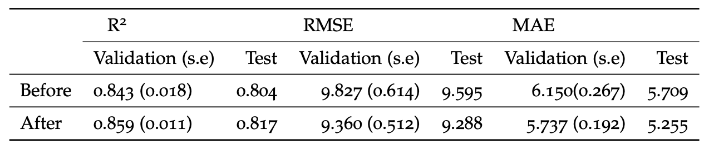

# Harmful algal bloom events prediction: comparing machine learning and deep learning algorithms
This is my master's thesis project, where I endeavored to address a research gap based on previous literature in the field of harmful algal bloom events (HABs) prediction. In my research, I adopted several imputation methods and compared various linear regression algorithms to assess the feasibility of enhancing experimental efficiency, enabling governments to prioritize resources in water quality management and future researchers aiming to enhance their models for water environment studies can use the features identified in this research as a reference, and the method employed in this paper has the potential to expedite the setup of their experiments.

## Table of contents
* [Problem Statement](#Problem-statement)
* [Research Questions](#Research-questions)
* [Dataset](#dataset)
* [Method](#method)
* [Implementation](#inplementation)
* [Conclusion](#findings-and-conclusion)

## Problem statement
Given the increasing prevalence of harmful algal bloom events (HABs) and their detrimental impact on coastal regions worldwide, the timely and accurate detection of these events has become of paramount importance. The advent of machine learning techniques has offered promising avenues for addressing this imperative need. However, few studies have addressed the issue of datasets with high sparsity in HABs prediction using machine learning techniques. The goal of this study is to determine whether the utilization of factual data can achieve comparable model performance in predicting HABs compared to imputed data using machine learning and deep learning algorithms, specifically when encountering datasets containing a large amount of missing values.

## Research questions
### Main Research Question
How to predict harmful algal bloom events in New York Harbor by using machine learning and deep learning algorithms with and without data imputations? 
### Supporting Questions 

SQ1: To what extent do machine learning and deep learning models perform differently with factual data and data undergone imputation with multiple techniques?

SQ2: Which are the most important water quality indicators that contribute to harmful algal bloom events in New York Harbor?

## Dataset
The study utilized a dataset from [New York Open Data](https://data.cityofnewyork.us/Environment/Harbor-Water-Quality/5uug-f49n), containing over 89,000 rows of water quality parameters. Chlorophyll-a (Chl-a) is used as the target. 
	

## Method	
To address the first sub-question, SQ1, which investigates the performance disparities between machine learning and deep learning models when using factual data versus data that has undergone imputation with multiple techniques (Median, KNN and MICE), two distinct datasets are prepared. Furthermore, a range of models are employed (RF, SVR and ANN), and evaluation metrics (R2, RMSE and MAE) are established to compare and evaluate their performance. This process enables the identification of the most effective model for subsequent feature selection to answer the second sub-question, SQ2.
The flowchart shows steps from raw data to feature selection

After the EDA and data cleaning, a pipeline architecture was implemented for robust model development, including data preprocessing, hyperparameter tuning, and validation. The performance of different models was compared using evaluation metrics, and error analysis was also conducted. For example, the figure below is SVR Error Analysis. The first row of plots compares the predicted values to the actual values. It shows how well the model’s predictions align with the true values. The red dashed line represents perfect alignment between predicted and actual values. The second row of plots displays the distribution of residuals. The x-axis represents the residuals, which are the differences between the actual target values and the corresponding predicted values. The y-axis represents the density of the residuals. 

## Implementation
Project is created with:
* Python version: 3.10.11
* Scikit-learn version: 1.2.2
* Matplotlib version: 3.7.1
* Google Colab

## Findings and Conclusion
Based on the table below, SVR with median imputation was selected for feature permutation and selection analyses. In the table, the method of using factual data is denoted as ’No Imputation’. The numbers are 5-fold cross-validation and test scores with best hyperparameters, based on R2, RMSE and MAE. The standard errors obtained from a 5-fold cross-validation approach are reported within brackets as (s.e). The best score of R2, RMSE and MAE of all the models across each imputation method is marked in yellow.

The chosen model SVR with median imputation achieved the highest R2 score of 0.859, RMSE score of 9.360, and MAE score of 5.737 after feature selection. The table below displays model perfomance after feature model_selection.  

This study confirmed that the utilization of domain knowledge enhanced the efficiency of HABs prediction Further, models using factual data showed comparable performance to those using imputation techniques.
What's more, seventeen important water quality parameters were identified for predicting HABs in New York Harbor, including fluorometers, pH, and dissolved oxygen (DO), where
several novel predictors, such as fluorometers, nitrate/nitrite, and ammonium, emerged as promising variables for HABs prediction.

The study's findings have significant societal and scientific relevance, including facilitating early detection of pollution events, prioritizing water quality management, and improving our understanding of complex aquatic ecosystems through machine learning based water quality analysis.

## Discussion 

This study did not show the superiority of either machine learning algorithms or deep learning algorithms in terms of model performance, which contradicts earlier research. Additionally, some literature mentioned that SVM could be computationally expensive when the data point has high dimensionality. In our study, SVR was the fastest model, and ANN took the most time, especially during randomized grid search and cross-validations. We suspect that the reason could be that our dataset is not big enough to cause excessive computation time for SVR.

We identified the most 17 influential features, such as DO, pH, and temperature, for HABs prediction in New York Harbor. This finding reaffirmed the value of domain knowledge in feature selection. By incorporating five features extracted from previous studies, which ranked among the top six in feature importance permutation, we were able to expedite the initial experimentation process.
Moreover, the identification of novel predictors for HABs, such as fluorometers, ammonium, and nitrate/nitrite, in our study can be attributed to the discretion of various entities responsible for water quality management. These entities have the authority to select specific parameters for measurement based on their relevance and priorities. Hence, the absence of these particular parameters in studies conducted in other water systems does not imply their nonexistence in those systems.

Notably, features such as weather and current speed, identified as influential predictors in a monsoon-like climate, exhibited no prediction power in our investigation of New York Harbor. We suspect that the distinctly different climate is the reason. Unfortunately, we cannot draw conclusive findings regarding their effectiveness in predicting HABs in New York Harbor due to the complete absence of these two features after the filtering process, coupled with the inadequacy of our imputation methods.

Furthermore, Yajima and Derot (2017) expressed skepticism regarding the predictive power of models with small datasets. However, our results demonstrated that the dataset size did not hinder its prediction ability, Nevertheless, we remain cautious about the generalizability of our results, considering the limited sample size of only 1572.

The strength of this research lies in the adoption of evaluation methods and models derived from previous studies in the field, which were deemed representative and practical. Additionally, the utilization of a pipeline, k-fold cross-validations, and the use of a random state ensured consistency and reproducibility of our results.